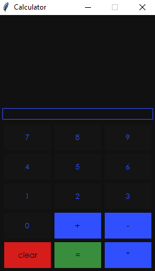

# Calculator



## Introduction
This is a simple GUI, calculator application that I built in an attempt to excercise my Python and Tkinter capabilities.

**Version:** 4.0.0<br>
**Implemented language:** Python.<br>
**Project status:** Not under maintenance.

## Features
The standard features include:
1. Adding numbers.
1. Subtracting numbers.
1. Multiplying numbers.
1. Dividing numbers.

## Technologies
* Python 3.6
* Tkinter

# Requirements
1. Windows OS(**Windows 10 is recommended**).
1. Python(**Verison 3.6 or above**).

## Launch
```python
python calculator_gui4
```
If the above command does not work, try this:
```python
python3 calculator_gui4
```

## Inspiration
This application was initially developed as a result of a YouTube tutorial by John Elder (aka Codemy) regarding a [simple calculator application](https://www.youtube.com/watch?v=F5PfbC5ld-Q&list=PLCC34OHNcOtoC6GglhF3ncJ5rLwQrLGnV&index=5).
